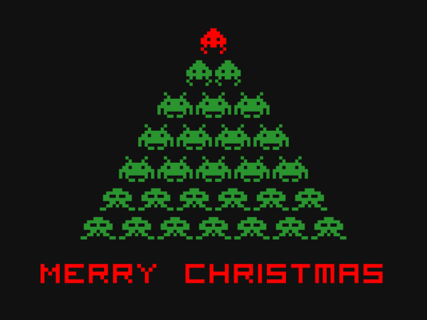

# P12_Classification

Par Aude, Erwan et Ludivine

Classification des chiffres manuscrits

## Contenu

* __mnist_sgd__ : Premier modèle avec un classifier SGD
* __mnist_cnn__ : Modèle avec un réseau de neurones convolutif

## Interface de reconnaissance 

* __mnist_sgd__ : Premier modèle avec un classifier SGD
* __mnist_cnn__ : 

Joyeux Noël !     *<]:{)

